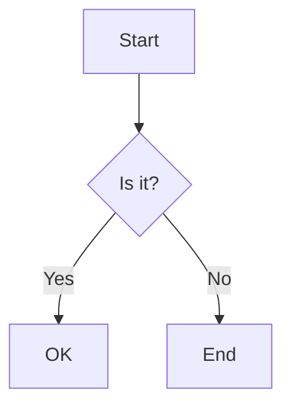
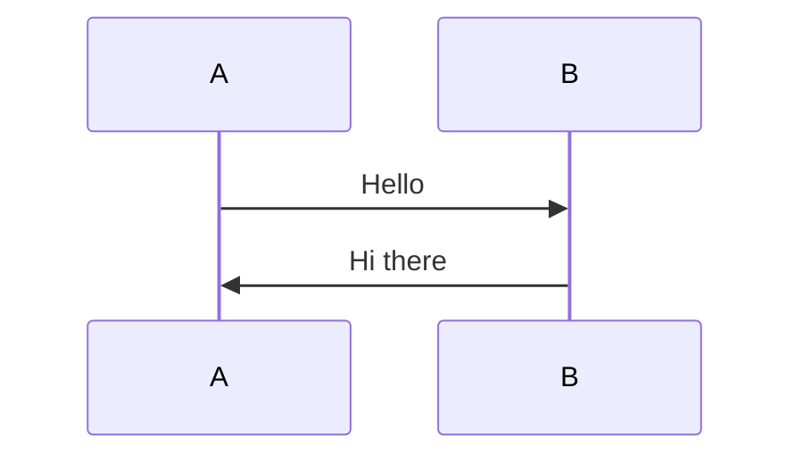
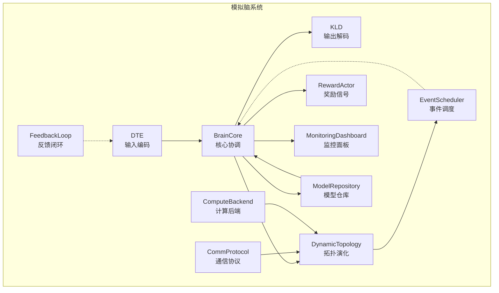
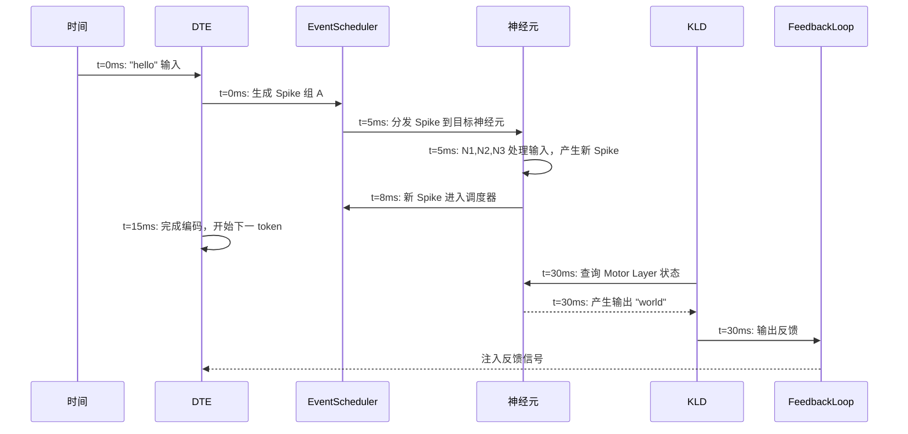
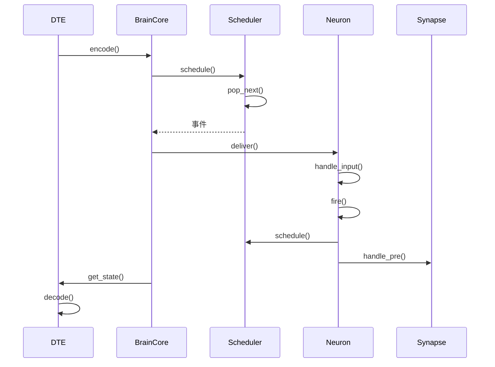

# Mermaid Test

## Test 1: Simple Flowchart (correct)

## Test 2: Sequence Diagram (correct)

## Test 3: Chinese labels with br (correct)

## Test 4: Full Chinese flowchart (correct)

## Test 5: Chinese flowchart full (correct)

## Test 6: Event sequence (correct)

End of tests.
